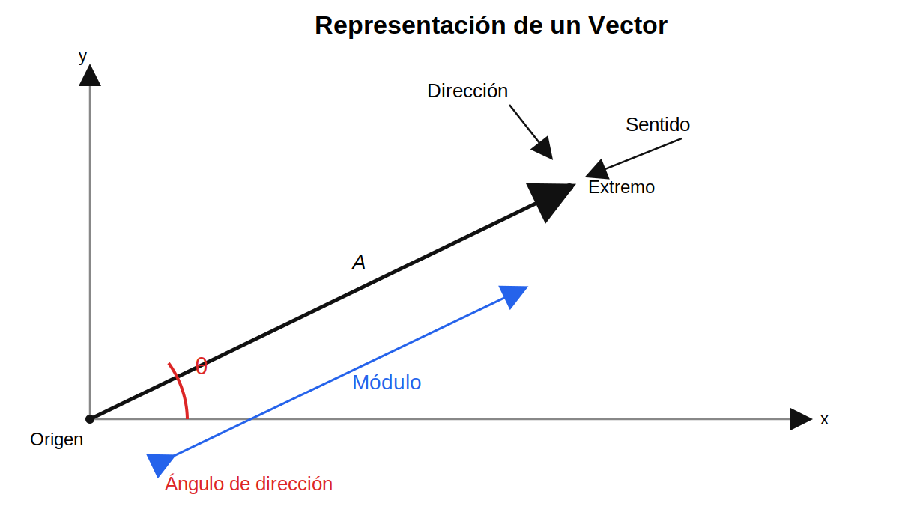
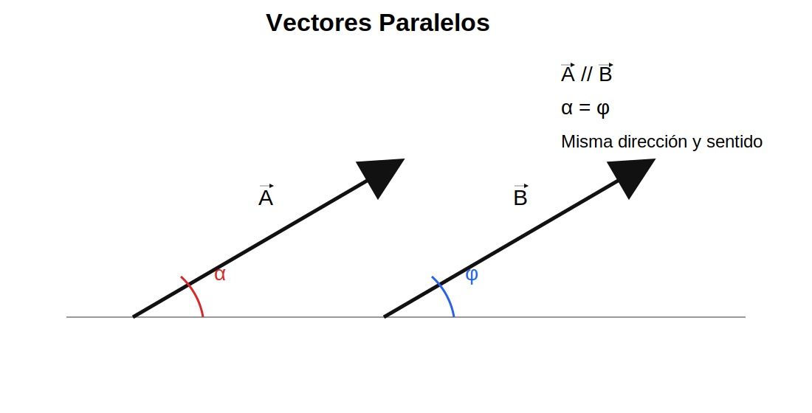
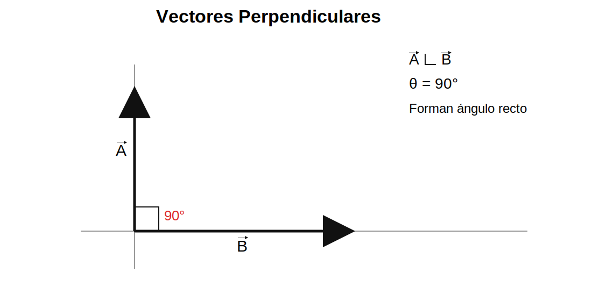
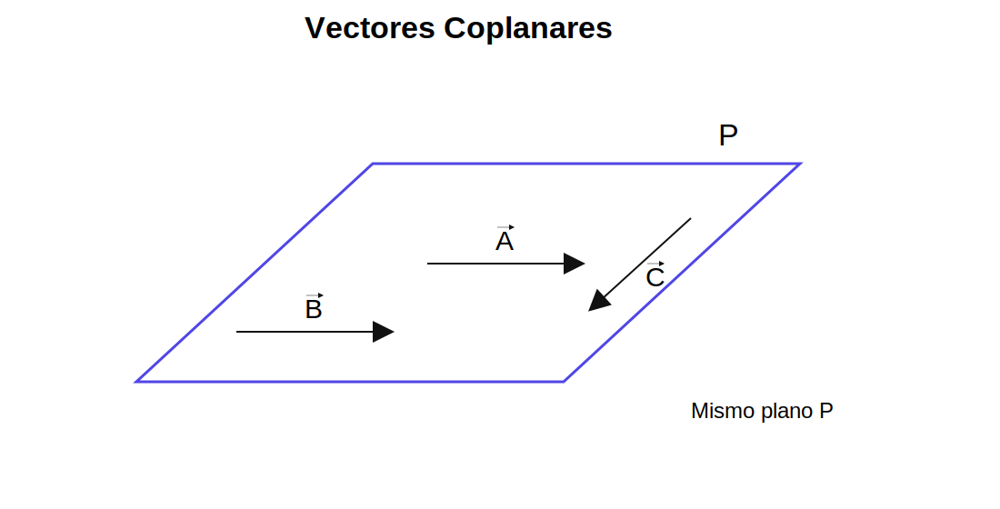
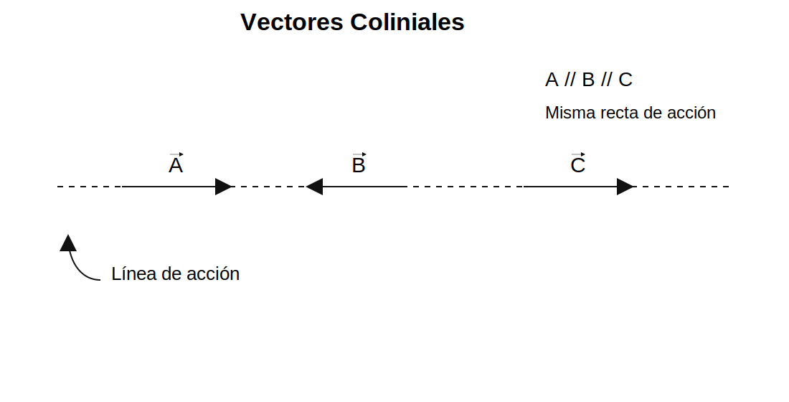

# Tema 09: Vectores

## 1. Introducción

En física existen magnitudes que no solo requieren un valor numérico y una unidad, sino también una dirección y un sentido para quedar completamente definidas. Estas magnitudes reciben el nombre de **vectores**.

Los vectores permiten representar fenómenos donde importa tanto la intensidad como la orientación en el espacio.

Se utilizan en:

- fuerzas aplicadas sobre cuerpos  
- velocidad de un móvil  
- aceleración  
- desplazamiento  
- campos eléctricos y magnéticos  

Por esta razón, el estudio de vectores es fundamental en física e ingeniería.

---

## 2. Definición

Un vector es una magnitud física que para quedar completamente determinada necesita:

- módulo o magnitud  
- dirección  
- sentido  

Se representa gráficamente mediante una flecha orientada.

---

## 3. Representación de un Vector

Un vector se representa mediante un segmento dirigido desde un punto inicial hacia un punto final.

**Gráfico:**  

---

## 4. Partes del Vector

### Origen

Es el punto donde comienza el vector.

### Extremo

Es el punto final donde termina la flecha.

### Módulo

Es la longitud del vector y representa su intensidad.

### Dirección

Es la orientación del vector respecto a un sistema de referencia. Generalmente se expresa mediante un ángulo.

### Sentido

Indica hacia qué lado apunta la flecha.

---

## 5. Magnitud Escalar y Magnitud Vectorial

### Magnitud Escalar

Es aquella magnitud que queda determinada solo con:

- valor numérico  
- unidad  

No necesita dirección ni sentido.

**Ejemplos:**

- masa = 8 kg  
- tiempo = 10 s  
- temperatura = 25 °C  
- energía = 200 J  

---

### Magnitud Vectorial

Es aquella magnitud que necesita:

- valor numérico  
- unidad  
- dirección  
- sentido  

**Ejemplos:**

- fuerza = 20 N hacia la derecha  
- velocidad = 15 m/s al norte  
- aceleración = 3 m/s² hacia abajo  
- desplazamiento = 10 m al este  

---

## 6. Tipos de Vectores

Los vectores se clasifican según la posición que ocupan en el espacio y la relación geométrica entre sus direcciones.

---

### a) Vectores Paralelos

Dos o más vectores son paralelos cuando tienen la misma dirección.

Pueden tener:

- mismo sentido  
- sentido contrario  
- igual o diferente magnitud  

**Representación:**

A // B

**Gráfico:**  

---

### b) Vectores Perpendiculares

Dos vectores son perpendiculares cuando forman entre sí un ángulo recto de 90°.

**Representación:**

A ⟂ B

**Gráfico:**  

---

### c) Vectores Coplanares

Dos o más vectores son coplanares cuando se encuentran en un mismo plano.

**Representación:**

A, B y C pertenecen al plano P

**Gráfico:**  

---

### d) Vectores Coliniales

Dos o más vectores son coliniales cuando se encuentran sobre una misma recta.

Todos los coliniales son paralelos, pero además comparten la misma línea de acción.

**Representación:**

A // B // C

**Gráfico:**  

---

## 7. Resumen

| Tipo | Característica |
|------|----------------|
| Paralelos | Misma dirección |
| Perpendiculares | Forman 90° |
| Coplanares | Están en un mismo plano |
| Coliniales | Están en una misma recta |

---

## 8. Importancia

El estudio de vectores permite:

- representar fuerzas correctamente  
- sumar y restar magnitudes vectoriales  
- calcular resultantes  
- analizar equilibrio  
- estudiar movimientos en dos y tres dimensiones  
