# Tema 09: Vectores

## 1. Introducción

En física existen magnitudes que no solo requieren valor numérico y unidad, sino también dirección y sentido. Estas magnitudes reciben el nombre de **vectores**.

Se utilizan para representar fenómenos donde importa tanto la intensidad como la orientación espacial.

| Aplicaciones de los vectores |
|------------------------------|
| Fuerzas |
| Velocidad |
| Aceleración |
| Desplazamiento |
| Campos eléctricos y magnéticos |

---

## 2. Definición

Un vector es una magnitud física que para quedar completamente determinada necesita:

| Elementos del vector |
|----------------------|
| Módulo o magnitud |
| Dirección |
| Sentido |

Se representa gráficamente mediante una flecha orientada.

---

## 3. Representación de un Vector

Un vector se representa mediante un segmento dirigido desde un punto inicial hasta un punto final.

**Gráfico:**  

---

## 4. Partes del Vector

| Parte | Descripción |
|------|-------------|
| Origen | Punto donde comienza el vector |
| Extremo | Punto final de la flecha |
| Módulo | Longitud del vector |
| Dirección | Orientación respecto a un eje |
| Sentido | Hacia dónde apunta |

---

## 5. Magnitudes Escalares y Vectoriales

| Tipo | Características | Ejemplos |
|------|----------------|----------|
| Escalar | Valor numérico + unidad | masa, tiempo, energía, temperatura |
| Vectorial | Valor numérico + unidad + dirección + sentido | fuerza, velocidad, aceleración, desplazamiento |

---

## 6. Tipos de Vectores

| Tipo | Característica | Gráfico |
|------|----------------|--------|
| Paralelos | Misma dirección |  |
| Perpendiculares | Forman 90° |  |
| Coplanares | En un mismo plano |  |
| Coliniales | En una misma recta |  |

---

## 7. Operaciones con Vectores

Las operaciones vectoriales permiten combinar magnitudes dirigidas.

---

# 7.1 Suma y Resta de Vectores

## Definición

| Operación | Expresión |
|----------|-----------|
| Suma | R = A + B |
| Resta | R = A - B = A + (-B) |

---

## a) En términos de vectores unitarios

Si:

A = Axî + Ayĵ + Azk̂  
B = Bxî + Byĵ + Bzk̂

| Operación | Resultado |
|----------|-----------|
| Suma | (Ax+Bx)î + (Ay+By)ĵ + (Az+Bz)k̂ |
| Resta | (Ax-Bx)î + (Ay-By)ĵ + (Az-Bz)k̂ |

### Ejercicio 1

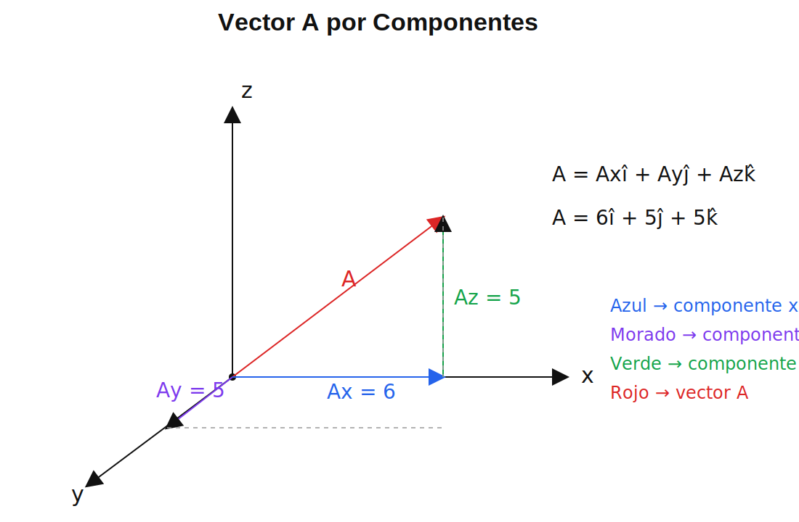

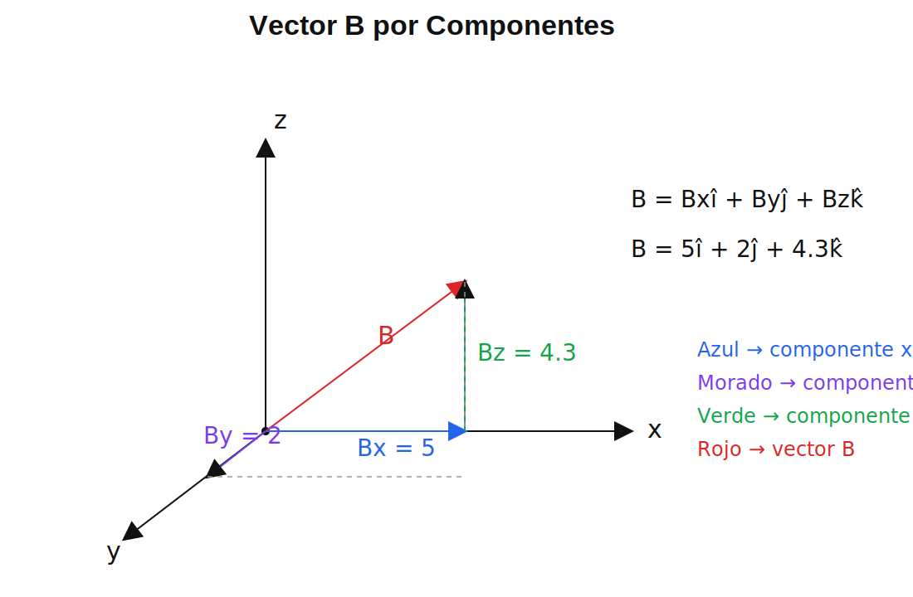

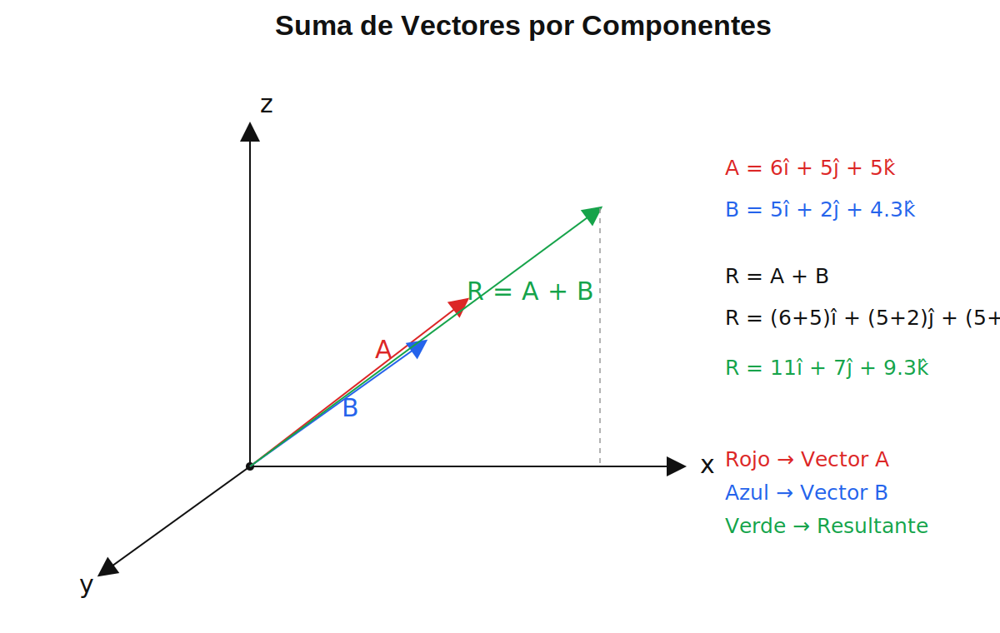

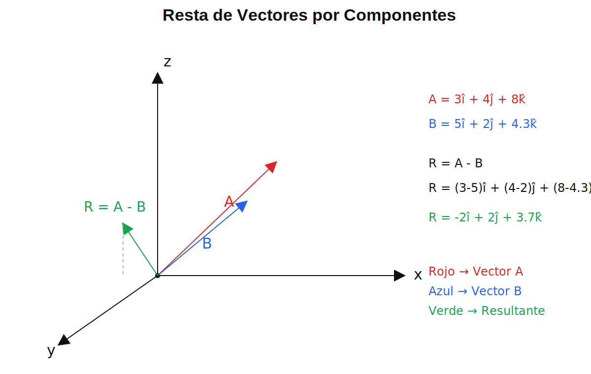

### Ejercicio 2

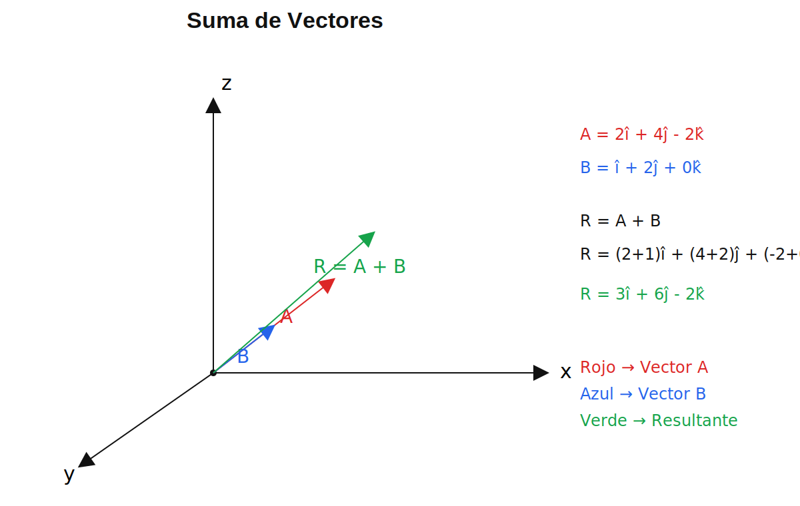

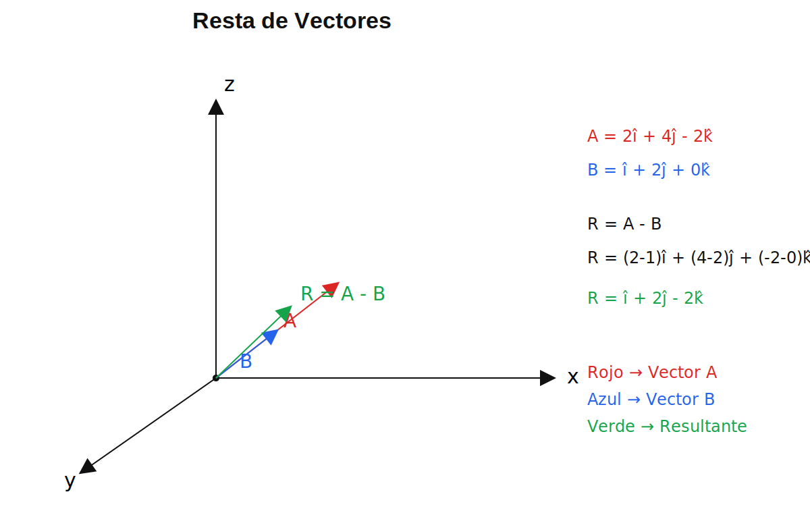

---

## b) Método del Paralelogramo

Se dibujan dos vectores desde el mismo origen y se completa un paralelogramo.

| Operación | Resultado |
|----------|-----------|
| Suma | A + B |
| Resta | A + (-B) |

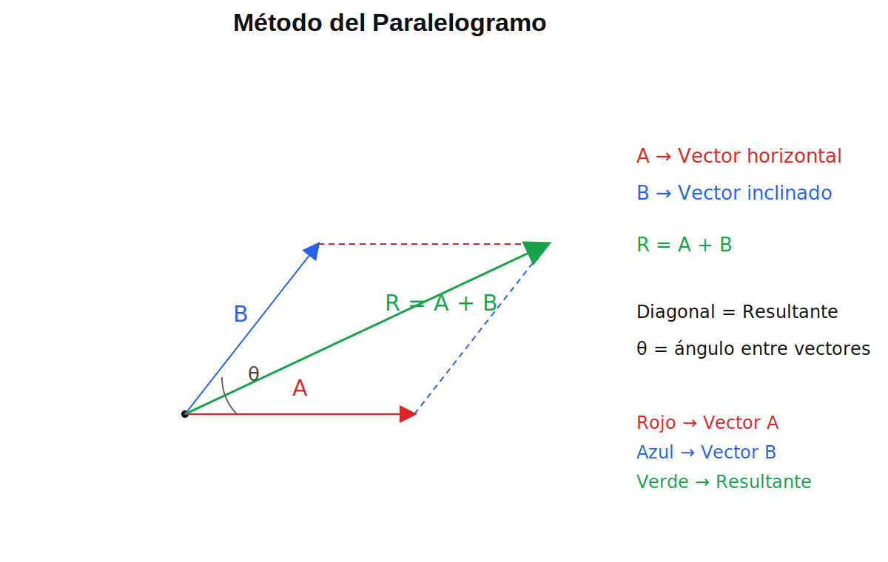

### Ejercicios

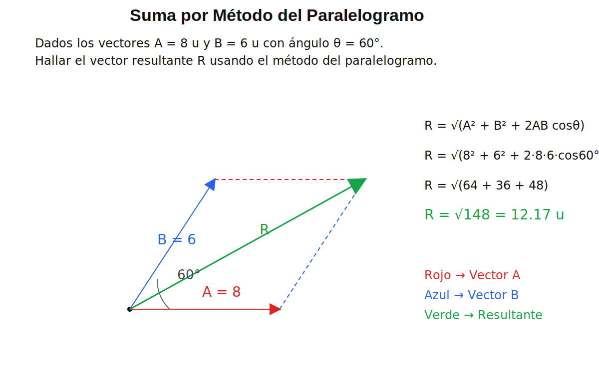

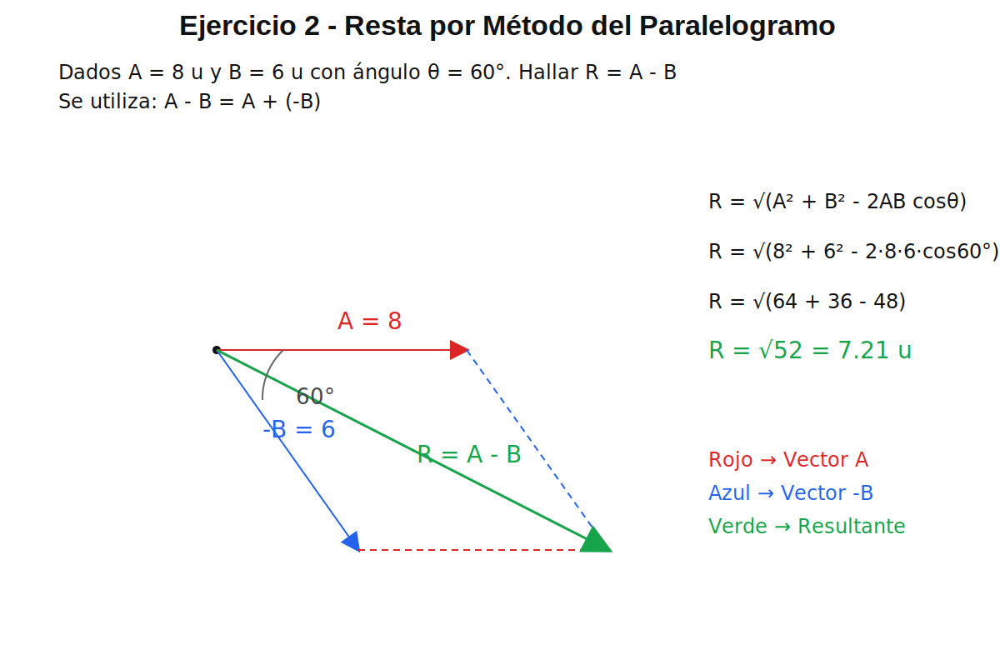

---

## c) Método de Descomposición

Consiste en separar cada vector en componentes.

| Componente |
|-----------|
| Rx = Ax ± Bx |
| Ry = Ay ± By |
| Rz = Az ± Bz |

R = Rxî + Ryĵ + Rzk̂

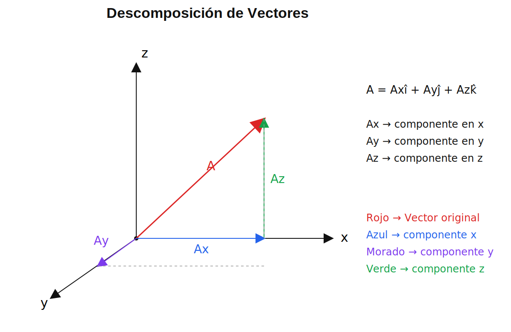

### Ejercicios

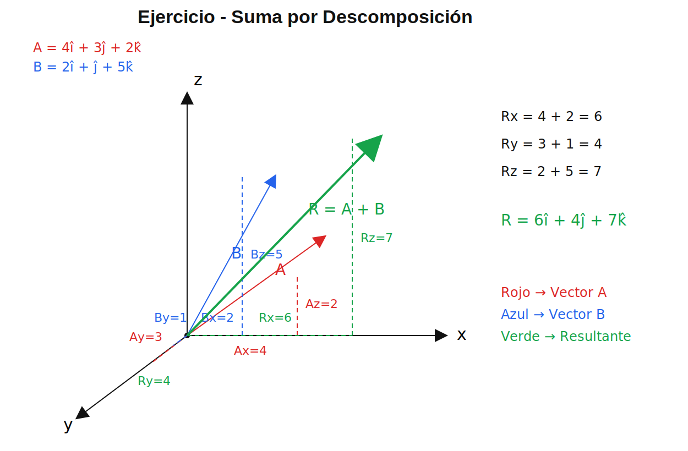

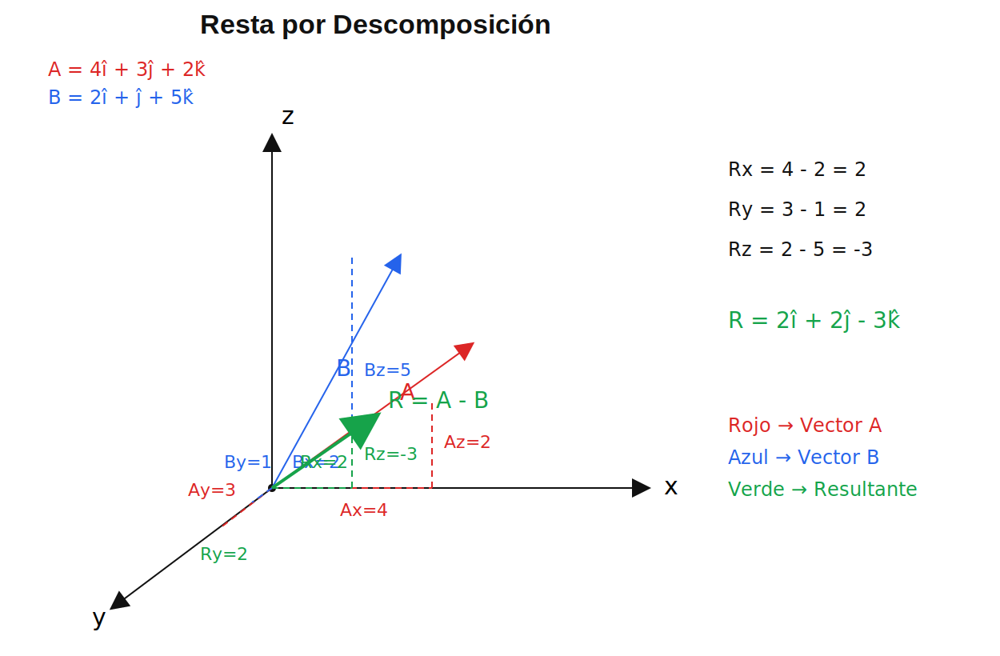

---

## Propiedades de la Suma y Resta de Vectores

Las propiedades vectoriales son reglas matemáticas que facilitan las operaciones entre vectores y permiten resolver problemas de forma ordenada.

| Propiedad | Expresión | Explicación |
|----------|-----------|------------|
| Conmutativa | A + B = B + A | El orden de los vectores no cambia el resultado de la suma. |
| Asociativa | (A + B) + C = A + (B + C) | La forma de agrupar tres o más vectores no modifica la resultante final. |
| Elemento neutro | A + 0 = A | El vector nulo no altera al vector original cuando se suma. |
| Inverso aditivo | A + (-A) = 0 | Todo vector posee un opuesto de igual magnitud y sentido contrario que lo anula. |
| Clausura | A ± B = vector | La suma o resta de vectores siempre produce otro vector. |
| Resta equivalente | A - B = A + (-B) | Restar un vector equivale a sumar su vector opuesto. |

### Importancia

Estas propiedades permiten:

- simplificar operaciones vectoriales  
- reorganizar cálculos  
- verificar resultados  
- resolver problemas físicos con mayor facilidad

---

## Conclusión

Los vectores son herramientas fundamentales en física y matemáticas.  
La suma y resta vectorial permiten resolver problemas reales mediante métodos gráficos y analíticos.
